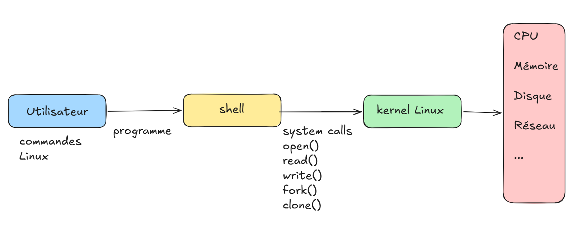
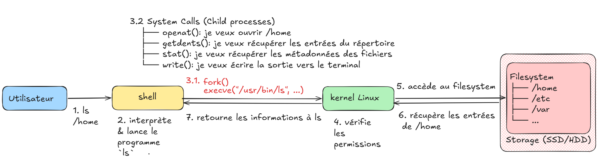
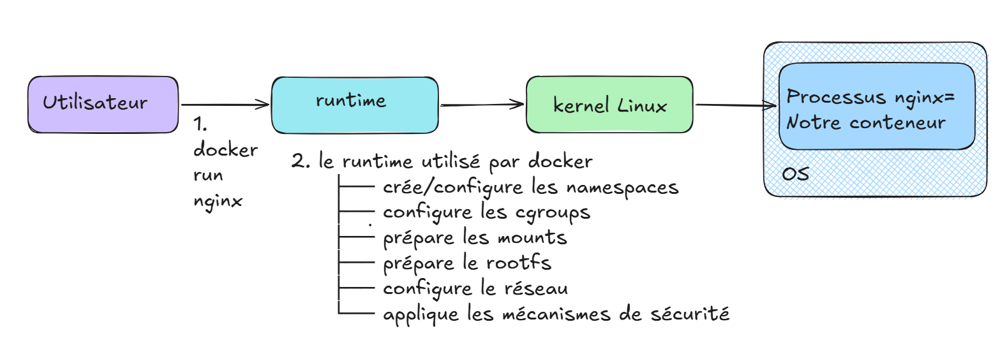

# 00 — Linux Foundations for Containerization

> **Objectif :** comprendre les mécanismes fondamentaux de Linux qui permettent aux conteneurs de fonctionner avant d'étudier leur construction et les outils comme Docker, Podman, containerd et runc.

---

## 0. Pourquoi commencer par Linux ?

Un conteneur n'est pas une machine virtuelle complète.

Il repose principalement sur les mécanismes fournis par le **kernel Linux** pour :

- créer et gérer des processus ;
- isoler les processus ;
- contrôler les ressources ;
- gérer les systèmes de fichiers ;
- gérer le réseau ;
- contrôler les permissions et les capacités.

L'idée fondamentale est donc :



Comprendre cette chaîne permet de comprendre ensuite ce que font réellement les runtimes de conteneurs.


# 1. Processus

Un **processus** est simplement un programme en cours d'exécution.

Par exemple :

```bash
sleep 100
```

Lorsque cette commande s'exécute, Linux crée un processus correspondant au programme `sleep`.

On peut voir les processus avec :

```bash
ps
```

ou :

```bash
ps aux
```

ou :

```bash
top
```

Chaque processus possède un identifiant appelé **PID** :

```text
PID = Process ID
```

Exemple :

```text
PID   COMMAND
1     systemd
1200  sshd
2450  bash
3100  nginx
```

Le PID permet au kernel et aux outils Linux d'identifier les processus.
---
Mini-lab intégré — Observer les processus d'un conteneur
```bash
docker run -d --name linux-lab nginx
```
Vérifier qu'il fonctionne :
```bash
docker ps
```
Observer les processus à l'intérieur du conteneur :
```bash
docker exec linux-lab ps aux
```
Récupérer le PID réel du conteneur sur l'hôte :
```bash
docker inspect --format '{{.State.Pid}}' linux-lab
```
Puis :
```bash
PID=$(docker inspect --format '{{.State.Pid}}' linux-lab)
ps -fp "$PID"
```
---

# 2. Le Kernel Linux

Le **kernel**, appelé **noyau** en français, est le cœur du système d'exploitation.

C'est un programme logiciel de très bas niveau qui assure l'intermédiaire entre les programmes et les ressources de la machine.





Ce schéma montre ce qui se passe lorsqu'un utilisateur exécute la commande ls /home, depuis le Shell jusqu'au Kernel Linux.

1. L'utilisateur saisit la commande ls /home dans le terminal.
2. Bash (Shell) interprète la commande et doit lancer le programme ls. Il crée généralement un processus enfant avec fork().
3. Le processus enfant utilise execve() pour charger et exécuter le programme /usr/bin/ls.
4. ls doit maintenant obtenir les informations sur /home. Pour cela, il ne communique pas directement avec le disque : il utilise des System Calls comme openat(), getdents64(), stat()/statx() et write() pour demander des services au Kernel.
5. Le Kernel Linux reçoit ces appels, vérifie notamment les permissions et utilise les mécanismes du filesystem pour accéder aux informations demandées.
6. Le Kernel récupère les entrées de /home et retourne les informations au programme ls.
7. Enfin, ls traite et formate ces informations, puis les affiche dans le terminal.
À retenir

Le Shell lance le programme, le programme utilise des System Calls, et le Kernel réalise les opérations nécessaires sur les ressources du système.


#### Quelques System Calls importants

| System Call | Rôle simplifié |
|---|---|
| `open()` / `openat()` | Ouvrir un fichier |
| `read()` | Lire des données |
| `write()` | Écrire des données |
| `close()` | Fermer un fichier |
| `fork()`, `execve()` | Créer un nouveau processus |
| `wait4()` | Attendre un processus |
| `mount()` | Monter un filesystem |
| `unshare()` | Séparer un processus de certains namespaces |
| `chroot()` | Changer la racine apparente d'un processus |
| `pivot_root()` | Changer la racine du filesystem d'un environnement |

Ces appels système sont particulièrement importants pour comprendre la création et l'isolation des conteneurs.

---

Observer le processus principal du conteneur :

```bash
docker exec linux-lab cat /proc/1/status
```
Inspection depuis l'hôte

```bash
PID=$(docker inspect --format '{{.State.Pid}}' linux-lab)
cat /proc/"$PID"/status
```

On retrouve ainsi les informations du processus directement exposées par le kernel Linux.
Pour observer les System Calls d'un processus, on peut utiliser strace sur l'hôte :
```bash
strace -p "$PID"
```

À observer :

Le programme ne communique pas directement avec le matériel. Il passe par les interfaces fournies par le kernel, notamment les System Calls.

---

# 3. Filesystem

Un **filesystem** est le mécanisme permettant d'organiser et de gérer les fichiers et répertoires sur un système de stockage.

Exemples :

- ext4
- XFS
- Btrfs

Linux présente les ressources sous forme d'une arborescence.

Exemple :

```text
/
├── bin/
├── etc/
├── home/
├── proc/
├── sys/
├── tmp/
├── usr/
└── var/
```

La racine de cette arborescence est :

```text
/
```
---
Observer la racine du conteneur :

```bash
docker exec linux-lab ls /
```
```bash
docker exec linux-lab ls /etc
docker exec linux-lab ls /usr
docker exec linux-lab ls /var
```
Inspection

```bash
docker inspect --format '{{json .Mounts}}' linux-lab
```
À observer :
Le processus du conteneur voit une arborescence de fichiers qui constitue son environnement filesystem.
---

# 4. Root Filesystem — `rootfs`

Le **root filesystem**, souvent appelé `rootfs` dans le contexte des conteneurs, représente le système de fichiers visible comme racine `/` par un processus.

Un rootfs minimal peut contenir par exemple :

```text
rootfs/
├── bin/
├── etc/
├── lib/
├── proc/
├── tmp/
├── usr/
└── var/
```

Un conteneur n'a pas nécessairement besoin d'un système complet comme une machine virtuelle.

Il peut utiliser un filesystem minimal contenant uniquement les fichiers nécessaires à son application.
---

Observer la racine visible depuis le conteneur :

```bash
docker exec linux-lab sh -c 'pwd; ls -la /'
```
Observer la racine du processus principal :
```bash
docker exec linux-lab readlink /proc/1/root
```

Inspection depuis l'hôte
```bash
PID=$(docker inspect --format '{{.State.Pid}}' linux-lab)
readlink /proc/"$PID"/root
```
À observer :
Le processus possède une vue de filesystem qui lui apparaît comme /.
---

# 5. `/proc`

Linux expose de nombreuses informations sur le kernel et les processus à travers :

```text
/proc
```

Par exemple :

```bash
ls /proc
```

On peut trouver des répertoires correspondant aux PID :

```text
/proc/1
/proc/100
/proc/2000
```

On trouve également des informations générales comme :

```text
/proc/cpuinfo
/proc/meminfo
/proc/mounts
```

Dans les conteneurs, `/proc` est particulièrement intéressant car il peut refléter la vue des processus disponible dans le namespace du conteneur.

---

```bash
docker exec linux-lab ls /proc
```
Observer les informations système :
```bash
docker exec linux-lab cat /proc/cpuinfo
docker exec linux-lab cat /proc/meminfo
docker exec linux-lab cat /proc/mounts
```
Observer les PID visibles :
```bash
docker exec linux-lab ls /proc | grep '^[0-9]'
```
Comparer avec l'hôte :
```bash
ls /proc | grep '^[0-9]' | head
```
Inspection
```bash
PID=$(docker inspect --format '{{.State.Pid}}' linux-lab)
ls -l /proc/"$PID"/ns/pid
```

À observer :
/proc fournit une vue des processus et des informations du système. Cette vue sera particulièrement importante lorsque nous étudierons les namespaces.
---

# 6. Mount et Bind Mount


Linux permet de monter un filesystem dans l'arborescence.

Exemple :

```bash
mount /dev/sdb1 /mnt
```

Le contenu du filesystem devient alors accessible à partir de :

```text
/mnt
```

---

Un **bind mount** permet de rendre un répertoire existant accessible à un autre emplacement.

Exemple :

```bash
mount --bind /source /destination
```

On peut ainsi faire apparaître le même contenu à un autre endroit de l'arborescence.

Les mount namespaces permettent ensuite à différents processus d'avoir des vues différentes de l'arborescence des montages.
---
Créer un répertoire sur l'hôte :

```bash
mkdir -p /tmp/container-data
```
Créer un fichier :
```bash
echo "hello from host" > /tmp/container-data/test.txt
```
Créer un conteneur avec un bind mount :
```bash
docker run -d --name linux-lab-mount \
  --mount type=bind,src=/tmp/container-data,dst=/data \
  nginx
```
Observer le fichier depuis le conteneur :
```bash
docker exec linux-lab-mount cat /data/test.txt
```
Inspection
```bash
docker inspect --format '{{json .Mounts}}' linux-lab-mount
```
Puis :
```bash
docker exec linux-lab-mount findmnt
```
À observer :

Le même contenu présent sur l'hôte devient accessible dans le conteneur à travers /data.
---

# 7. `chroot`

`chroot` signifie :

```text
change root
```

Il permet de modifier la racine apparente (`/`) d'un processus.

Par exemple :

```bash
chroot /my-rootfs
```

Après cette opération, le processus considère :

```text
/my-rootfs
```

comme sa nouvelle racine `/`.

Conceptuellement :

```text
Système réel

/
├── etc
├── home
├── usr
└── my-rootfs
    ├── bin
    ├── etc
    └── usr
```

Avec `chroot` :

```text
Processus
   │
   └── voit /my-rootfs comme /
```
---

Observer la racine du processus principal du conteneur :

```bash
PID=$(docker inspect --format '{{.State.Pid}}' linux-lab)
readlink /proc/"$PID"/root
```
Puis comparer avec la vue depuis le conteneur :
```bash
docker exec linux-lab pwd
docker exec linux-lab ls /
```
Inspection
```bash
docker inspect linux-lab
```
À retenir :

chroot permet de changer la racine apparente, mais cela ne fournit pas à lui seul toutes les propriétés d'un conteneur.
---

# 8. `pivot_root`

`pivot_root()` permet de changer la racine du filesystem d'un environnement et de déplacer l'ancienne racine vers un autre emplacement.

Il est particulièrement pertinent lorsqu'on construit un environnement de filesystem isolé.

Dans une construction manuelle de conteneur, on peut rencontrer une séquence conceptuelle comme :

```text
Préparer rootfs
      ↓
Monter les filesystems nécessaires
      ↓
Changer la racine
      ↓
Masquer / détacher l'ancienne racine
      ↓
Exécuter le processus du conteneur
```

`pivot_root` est donc plus adapté à une véritable construction d'environnement isolé que le simple changement de racine fourni par `chroot`.
---
Nous allons observer le résultat final plutôt que d'exécuter directement `pivot_root`.

```bash
docker exec linux-lab readlink /proc/1/root
```
Puis :
```bash
docker exec linux-lab ls /
```
Inspection
```bash
PID=$(docker inspect --format '{{.State.Pid}}' linux-lab)
ls -l /proc/"$PID"/ns/mnt
```
À retenir :

Dans une construction réelle de conteneur, le changement de root intervient avec d'autres mécanismes Linux, notamment les mount namespaces.
---

# 9. Namespaces Linux

Les **Linux Namespaces** permettent d'isoler la vue qu'un processus possède de certaines ressources du système.

Une façon simple de retenir leur rôle est :

> **Namespace = "Qu'est-ce que le processus peut voir ?"**

Les conteneurs utilisent plusieurs types de namespaces.


## 9.1. PID Namespace

Le **PID namespace** isole la vue des processus.

Un processus dans un PID namespace peut avoir une vue différente des processus présents sur le système hôte.

Conceptuellement :

```text
Hôte

PID 1
PID 100
PID 200
PID 300
PID 400
```

Dans un namespace :

```text
Conteneur

PID 1
PID 2
PID 3
```

Le processus principal du conteneur peut donc apparaître comme :

```text
PID 1
```

à l'intérieur du conteneur.
---
Observer les processus depuis le conteneur :

```bash
docker exec linux-lab ps -ef
```
Observer le processus PID 1 :
```bash
docker exec linux-lab ps -p 1 -f
```
Inspection depuis l'hôte
```bash
PID=$(docker inspect --format '{{.State.Pid}}' linux-lab)

echo "PID sur l'hôte : $PID"
```
Puis :
```bash
ls -l /proc/"$PID"/ns/pid
```
Comparer :
```bash
docker exec linux-lab readlink /proc/1/ns/pid
```
avec :
```bash
readlink /proc/"$PID"/ns/pid
```
À observer :

À l'intérieur du conteneur, un processus peut apparaître comme PID 1, alors que ce même processus possède un autre PID dans la vue de l'hôte.
---

## 9.2. Network Namespace

Le **Network namespace** permet d'isoler l'environnement réseau.

Il peut isoler notamment :

- interfaces réseau ;
- adresses IP ;
- routes ;
- tables de routage ;
- ports.

Conceptuellement :

```text
Host network namespace
        │
        │ isolé
        ▼
Container network namespace
```

Les mécanismes comme `veth`, les bridges et le NAT permettent ensuite de connecter ces namespaces au réseau extérieur.
---
Observer les interfaces réseau du conteneur :
```bash
docker exec linux-lab ip addr
```
Observer les routes :
```bash
docker exec linux-lab ip route
```
Inspection avec Docker
```bash
docker inspect --format '{{json .NetworkSettings}}' linux-lab
```
Afficher directement l'IP :
```bash
docker inspect --format '{{range .NetworkSettings.Networks}}{{.IPAddress}}{{end}}' linux-lab
```
Inspection du namespace
```bash
PID=$(docker inspect --format '{{.State.Pid}}' linux-lab)
ls -l /proc/"$PID"/ns/net
```
À observer :

Le conteneur possède sa propre vue des interfaces réseau, des adresses IP et des routes.
---

## 9.3. Mount Namespace

Le **Mount namespace** permet à un processus d'avoir sa propre vue des montages.

Par exemple :

```text
Host
/
├── etc
├── home
├── var
└── data
```

Un autre namespace peut avoir une vue différente :

```text
Container
/
├── etc
├── app
├── proc
└── tmp
```

C'est un mécanisme fondamental pour construire le filesystem isolé d'un conteneur.

---
Observer les montages du conteneur :
```bash
docker exec linux-lab findmnt
```
Inspection
```bash
PID=$(docker inspect --format '{{.State.Pid}}' linux-lab)
ls -l /proc/"$PID"/ns/mnt
```
Comparer avec l'hôte :
```bash
readlink /proc/1/ns/mnt
```
et :
```bash
readlink /proc/"$PID"/ns/mnt
```
À observer :

Le processus du conteneur peut avoir une vue des montages différente de celle de l'hôte.
---

## 9.4. UTS Namespace

Le **UTS namespace** permet notamment d'isoler le hostname.

Par exemple :

```bash
hostname
```

Le système hôte peut avoir :

```text
hostname: server01
```

alors qu'un conteneur peut avoir :

```text
hostname: web-container
```

Les deux environnements peuvent donc avoir des hostnames différents.

---
Observer le hostname dans le conteneur :
```bash
docker exec linux-lab hostname
```
Comparer avec l'hôte :
```bash
hostname
```
Inspection
```bash
docker inspect --format '{{.Config.Hostname}}' linux-lab
```
Puis :
```bash
PID=$(docker inspect --format '{{.State.Pid}}' linux-lab)
ls -l /proc/"$PID"/ns/uts
```
À observer :

Le conteneur peut avoir un hostname différent de celui de l'hôte grâce au UTS namespace.
---

## 9.5. User Namespace

Le **User namespace** permet d'isoler les identifiants utilisateurs et groupes.

C'est particulièrement important pour le **rootless container**.

Un processus peut par exemple être :

```text
UID 0
```

à l'intérieur d'un namespace tout en correspondant à un utilisateur non-root sur l'hôte.

Cela permet de réduire les privilèges nécessaires à l'exécution de certains conteneurs.
---
Observer l'identité utilisateur :

```bash
docker exec linux-lab id
```
Puis :
```bash
docker exec linux-lab cat /proc/1/uid_map
docker exec linux-lab cat /proc/1/gid_map
```
Inspection
```bash
PID=$(docker inspect --format '{{.State.Pid}}' linux-lab)
ls -l /proc/"$PID"/ns/user
```

À observer :

Le User Namespace permet de gérer une correspondance entre les UID/GID vus dans le namespace et ceux de l'hôte.
---

## 9.10. Résumé des Namespaces

| Namespace | Ce qu'il isole principalement | Question à retenir |
|---|---|---|
| **PID** | Processus | Quels processus puis-je voir ? |
| **NET** | Réseau | Quelles interfaces/routes puis-je voir ? |
| **MNT** | Montages / filesystem | Quels montages puis-je voir ? |
| **UTS** | Hostname | Quel hostname suis-je ? |
| **USER** | UID/GID | Quelle identité utilisateur ai-je ? |


# 10. Cgroups


Les **Control Groups**, ou **cgroups**, permettent de contrôler et de limiter les ressources utilisées par des groupes de processus.

Une façon simple de retenir leur rôle :

> **Cgroup = "Combien de ressources le processus peut-il utiliser ?"**

Les namespaces et les cgroups ont donc des rôles différents :

```text
Namespaces → isolation / visibilité
Cgroups    → contrôle / limites de ressources
```


## 10.1. Limiter CPU

Le CPU exécute les instructions des programmes.

Plus un programme dispose de temps CPU, plus il peut effectuer de travail rapidement, toutes choses égales par ailleurs.

Dans un environnement conteneurisé, on peut limiter ou contrôler la quantité de CPU utilisable par un groupe de processus.

Conceptuellement :

```text
Container A → limite CPU
Container B → limite CPU
Container C → limite CPU
```


## 10.2. Mémoire

La mémoire RAM est utilisée pour conserver les données et programmes nécessaires à leur exécution.

Un conteneur peut être soumis à une limite mémoire.

Par exemple :

```text
Container
   │
   └── Memory limit = 512 MB
```

Cela permet d'empêcher un processus ou un groupe de processus de consommer une quantité illimitée de mémoire.


## 10.3. Limiter PIDs

Les cgroups peuvent également limiter le nombre de processus qu'un groupe peut créer.

Exemple conceptuel :

```text
Container
   │
   └── PID limit = 100
```

Cela peut notamment contribuer à limiter certains comportements excessifs ou certaines attaques de type fork bomb.

---

# 10.4. Limiter I/O

I/O signifie :

```text
Input / Output
```

Cela concerne notamment les opérations d'entrée/sortie vers les systèmes de stockage.

Les mécanismes de contrôle des ressources peuvent permettre de limiter ou organiser l'utilisation des ressources I/O.

---
Nous allons créer un conteneur avec plusieurs limites de ressources :

```bash
docker run -d \
  --name linux-lab-limited \
  --memory=128m \
  --cpus=0.5 \
  --pids-limit=50 \
  nginx
```
Inspection des limites
```bash
docker inspect --format \
'Memory={{.HostConfig.Memory}} | NanoCPUs={{.HostConfig.NanoCpus}} | PidsLimit={{.HostConfig.PidsLimit}}' \
linux-lab-limited
```
Observer le conteneur en fonctionnement
```bash
docker stats linux-lab-limited
```
On peut notamment observer :
```text
CPU %
MEM USAGE / LIMIT
MEM %
PIDS
```
---
# 10.5. Résumé des Cgroups

| Ressource | Exemple de contrôle |
|---|---|
| **CPU** | Limiter ou pondérer l'utilisation CPU |
| **Mémoire** | Définir une limite mémoire |
| **PIDs** | Limiter le nombre de processus |
| **I/O** | Contrôler les entrées/sorties |


# 11. Exemple complet : lancement d'un conteneur

Lorsque l'utilisateur exécute par exemple :

```bash
docker run nginx
```

la logique générale est beaucoup plus complexe, mais on peut la simplifier ainsi :



Le résultat est un processus Linux qui s'exécute dans un environnement isolé.

---

# . Ce qu'il faut absolument retenir

## Kernel

> Le kernel est le cœur du système d'exploitation. Il gère les ressources et fournit des services aux programmes.

## Shell

> Le Shell est un programme qui interprète les commandes de l'utilisateur et lance d'autres programmes.

## System Call

> Un System Call est une interface permettant à un programme de demander un service au kernel.

## Processus

> Un processus est un programme en cours d'exécution.

## `fork()`

> `fork()` permet de créer un nouveau processus. Il ne constitue pas à lui seul un mécanisme d'isolation de conteneur.

## `clone()`

> `clone()` / `clone3()` permettent de créer un processus avec un contrôle plus fin, notamment utile pour mettre en place des namespaces.

## Filesystem

> Le filesystem organise les fichiers et répertoires du système.

## Rootfs

> Le rootfs représente le système de fichiers visible comme `/` par un environnement.

## `chroot`

> `chroot` change la racine apparente d'un processus, mais ne suffit pas à créer un conteneur complet.

## `pivot_root`

> `pivot_root` permet de changer la racine d'un environnement de filesystem.

## Namespace

> Un namespace isole la vue d'un processus sur certaines ressources du système.

## Cgroup

> Un cgroup permet de contrôler les ressources utilisées par un groupe de processus.

---

# 42. Les deux questions clés des conteneurs

Pour retenir l'idée générale :

```text
        ┌─────────────────────────┐
        │       NAMESPACES        │
        │                         │
        │ "Qu'est-ce que je vois ?"│
        └────────────┬────────────┘
                     │
                     ▼
                ISOLATION


        ┌─────────────────────────┐
        │        CGROUPS          │
        │                         │
        │ "Combien puis-je utiliser ?"│
        └────────────┬────────────┘
                     │
                     ▼
             RESOURCE CONTROL
```

Puis on ajoute :

```text
Rootfs
   ↓
Quel filesystem vois-je ?

Network namespace
   ↓
Quel réseau vois-je ?

Security mechanisms
   ↓
Qu'ai-je le droit de faire ?
```

---

# Préparation pour la suite

Après avoir compris ces primitives Linux, nous pouvons passer à la construction manuelle d'un conteneur.

La prochaine étape sera de combiner concrètement :

```text
Rootfs
   +
Mount Namespace
   +
PID Namespace
   +
UTS Namespace
   +
Network Namespace
   +
Cgroups
   +
Process
   ↓
Mini-conteneur
```

L'objectif du chapitre suivant sera de construire progressivement cet environnement **sans commencer directement par Docker**, afin de comprendre ce que les outils de conteneurisation automatisent réellement.

---

# Mini-lab de découverte Linux

Avant de construire un conteneur manuellement, quelques commandes permettent d'observer les mécanismes étudiés.

## Observer les processus

```bash
ps aux
```

```bash
top
```

## Observer `/proc`

```bash
ls /proc
```

```bash
cat /proc/cpuinfo
```

```bash
cat /proc/meminfo
```

## Observer les namespaces

```bash
ls -l /proc/$$/ns/
```

On peut notamment observer :

```text
pid
mnt
net
uts
ipc
user
```

## Observer les informations d'un processus

```bash
cat /proc/$$/status
```

## Observer les montages

```bash
mount
```

ou :

```bash
findmnt
```

## Observer le hostname

```bash
hostname
```

## Observer les interfaces réseau

```bash
ip addr
```

## Observer les routes

```bash
ip route
```

Ces commandes permettent de relier les concepts théoriques aux mécanismes réellement présents sur Linux.

---

# Questions de compréhension

### Question 1

Quelle est la différence entre le Shell et le Kernel ?

### Question 2

Pourquoi une application utilise-t-elle des System Calls ?

### Question 3

Que fait `fork()` ?

### Question 4

Pourquoi `fork()` seul ne suffit-il pas à créer un conteneur ?

### Question 5

Quelle est la différence entre `fork()` et `clone()` ?

### Question 6

À quoi sert un PID namespace ?

### Question 7

À quoi sert un Network namespace ?

### Question 8

À quoi sert un Mount namespace ?

### Question 9

Quelle est la différence entre un Namespace et un Cgroup ?

### Question 10

Pourquoi `chroot` seul n'est-il pas équivalent à un conteneur ?

### Question 11

Quel rôle joue le rootfs ?

### Question 12

Quel est le rôle du kernel dans l'architecture d'un conteneur ?
