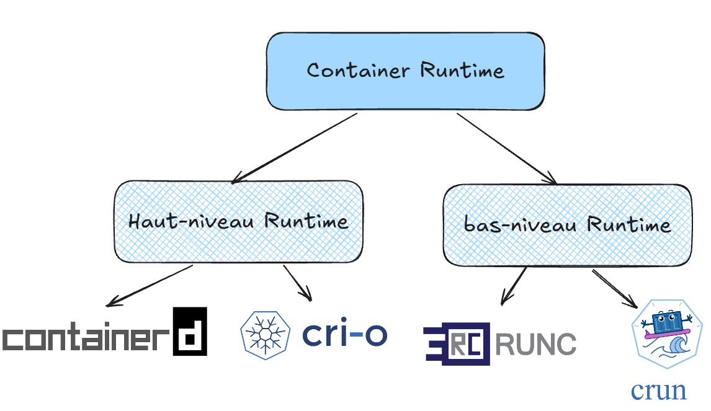
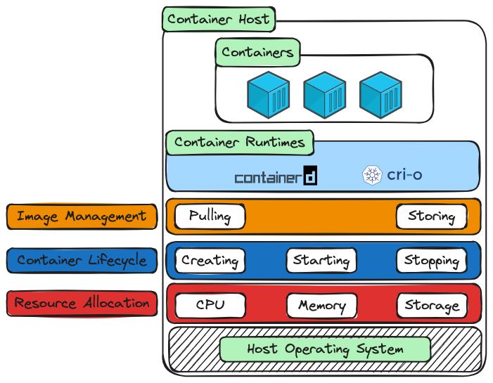
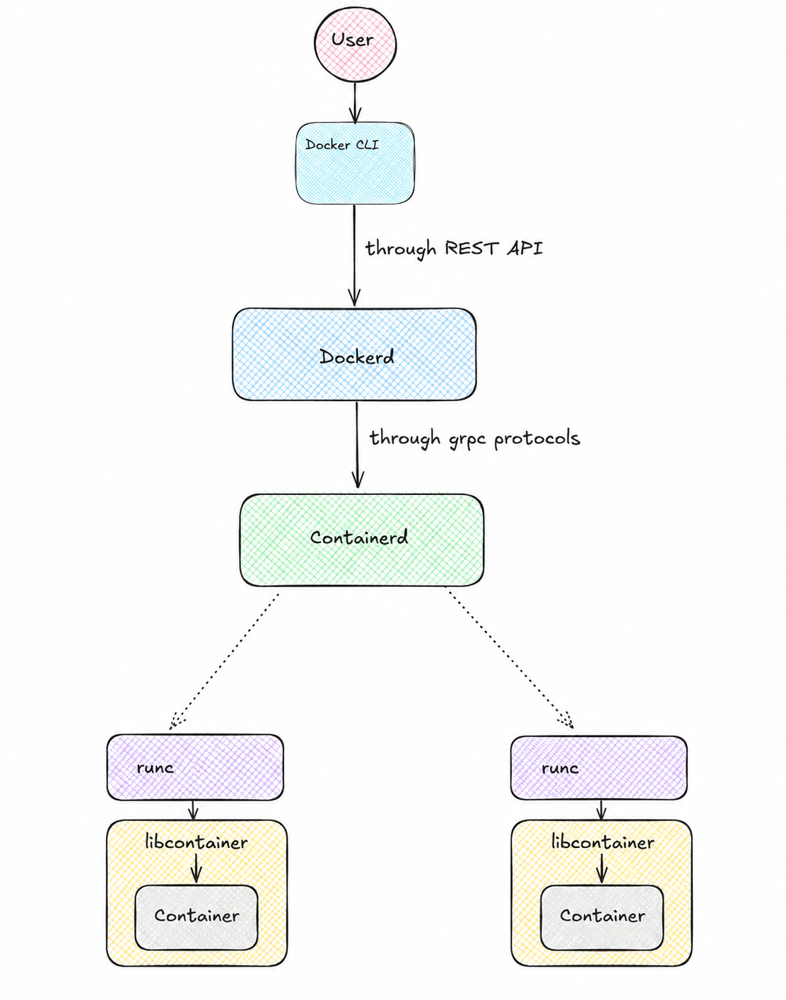

# 01 — Container Runtime, OCI, containerd et runc

> **Objectif :** comprendre le rôle d'un container runtime et situer Docker, containerd, CRI-O, OCI et runc dans la chaîne d'exécution d'un conteneur.

> **Idée clé :** le chapitre précédent expliquait **comment Linux isole un processus** ; ce chapitre explique **quels composants utilisent ces mécanismes pour exécuter et gérer des conteneurs**.

---

# 1. Du Linux Kernel au Container Runtime

Dans le chapitre précédent, nous avons étudié les mécanismes fondamentaux utilisés par les conteneurs :

```text
Linux Kernel
    │
    ├── Namespaces
    ├── cgroups
    ├── mounts
    ├── rootfs
    └── Process
```

Nous savons donc maintenant **comment Linux peut isoler et contrôler un processus**.

Mais une question reste :

> **Quel logiciel met en place tous ces mécanismes lorsqu'on demande de lancer un conteneur ?**

C'est le rôle du **container runtime**.


# 2. Qu'est-ce qu'un Container Runtime ?

Un **container runtime** est un logiciel responsable de la **gestion et/ou de l'exécution des conteneurs**, en utilisant les mécanismes fournis par le système d'exploitation.

Le terme est assez général. Dans l'écosystème moderne, on rencontre notamment deux niveaux :




L'idée générale est :

```text
High-Level: Gestion du conteneur
Low-Level: Exécution du processus
```

# 3. High-Level et Low-Level Runtime

## 3.1. High-Level Runtime

Un **high-level container runtime** gère les aspects généraux du conteneur, par exemple :

- les images ;
- le stockage du contenu ;
- les snapshots ;
- le cycle de vie ;
...

Exemples :

```text
containerd
CRI-O
```

> **High-level runtime = gérer et orchestrer le cycle de vie du conteneur.**

---

## 3.2. Low-Level Runtime

Un **low-level container runtime** est beaucoup plus proche du système d'exploitation et s'occupe de créer et exécuter le processus du conteneur.

Exemples :

```text
runc
crun
youki
```

Il utilise notamment :

```text
namespaces
cgroups
mounts
capabilities
seccomp
```

> **Low-level runtime = créer exécuter et isoler le processus du conteneur.**

---

# 4. Pourquoi cette séparation ?

Prenons :

```bash
docker run nginx
```

Derrière cette commande, plusieurs opérations doivent être réalisées :

```text
1. Trouver l'image
2. Télécharger l'image si nécessaire
3. Stocker ses layers
4. Préparer le filesystem
5. Créer le conteneur
6. Préparer le réseau
7. Configurer l'isolation
8. Configurer les ressources
9. Lancer le processus
```


Il est donc logique de séparer les responsabilités :

```text
High-Level Runtime
   │
   ▼
Low-Level Runtime
   │
   ▼
Linux Kernel
```

Cette séparation nous permet ensuite de comprendre pourquoi `containerd` et `runc` par exemple ne jouent pas exactement le même rôle.

---

# 5. OCI — Open Container Initiative

Maintenant qu'on comprend la notion de runtime, une autre question apparaît :

> **Comment différents runtimes peuvent-ils fonctionner selon des règles communes ?**

C'est là qu'intervient l'**OCI**.

## 5.1. Définition

**OCI (Open Container Initiative)** définit des **standards ouverts pour les images, les runtimes et la distribution des artefacts de conteneurs**.

C'est un ensemble de **spécifications communes**.

# 6. Les principales spécifications OCI

Les trois spécifications principales à connaître sont :

voir documentation officielle: https://specs.opencontainers.org/

## 6.1. OCI Image Specification

Elle définit le **format standard d'une image de conteneur**.

Conceptuellement :

```text
Image
 │
 ├── Manifest
 ├── Configuration
 └── Layers
```
## 6.2. OCI Runtime Specification

Elle définit le **modèle standard d'exécution d'un conteneur**.

Elle concerne notamment :

- le root filesystem ;
- le processus ;
- les paramètres d'exécution ;
- les namespaces ;
- les mounts ;
- les paramètres Linux ;
- le lifecycle.

Elle est notamment implémentée par des runtimes comme :

```text
runc
crun
youki
```

## 6.3. OCI Distribution Specification

Elle définit les règles permettant aux clients et aux registries d'échanger des artefacts OCI.

Conceptuellement :

```text
Client
  │
  │ pull / push
  ▼
Registry
```

Il faut donc distinguer :

```text
Image Specification → comment l'image est structurée

Distribution Specification → comment elle est distribuée

Runtime Specification → comment elle est exécutée
```
> **Docker fournit la plateforme, containerd gère le cycle de vie, runc exécute et Linux fournit les mécanismes d'isolation.**



> **Attention : OCI n'est pas une couche d'exécution placée entre containerd et runc. Il définit les standards auxquels les composants concernés se conforment.**

#### Inspection rapide de containerd 

Cette partie permet uniquement d'observer les composants présents sur une machine.

Elle ne constitue pas le TP de construction manuelle.

1. Lancer un conteneur de test

```bash
docker run -d --name runtime-lab nginx
```

2. Trouver le PID

```bash
docker inspect --format '{{.State.Pid}}' runtime-lab
```
3. Observer les namespaces

```bash
ls -l /proc/"$PID"/ns/
```

4. Vérifier containerd

```bash
containerd --version
systemctl status containerd
```

5. Vérifier runc

```bash
runc --version
which runc
```

6. Observer le shim

```bash
ps aux | grep containerd-shim
```
---

# 7. Ce qu'il faut retenir

### Container Runtime

> Un **container runtime** est un logiciel chargé de gérer et/ou d'exécuter des conteneurs.

### High-Level Runtime

> Un **high-level runtime** gère les images, les conteneurs, les snapshots, les tâches et le cycle de vie.

### Low-Level Runtime

> Un **low-level runtime** crée et exécute réellement le processus du conteneur en utilisant les mécanismes du système d'exploitation.

### OCI

> **OCI définit les standards ouverts utilisés par l'écosystème des conteneurs.**

### containerd

> **containerd est un high-level container runtime qui gère le cycle de vie des conteneurs et s'appuie sur un runtime OCI pour leur exécution.**

### CRI-O

> **CRI-O est un high-level container runtime conçu pour l'intégration Kubernetes via CRI.**

### runc

> **runc est un low-level OCI runtime qui exécute les processus des conteneurs.**

### Linux Kernel

> **Le kernel Linux fournit les mécanismes fondamentaux d'isolation et de contrôle.**

# Questions de compréhension

### Question 1

Qu'est-ce qu'un **Container Runtime** ?

### Question 2

Quelle est la différence entre un **High-Level Container Runtime** et un **Low-Level Container Runtime** ?

### Question 3

Citer deux exemples de **High-Level Container Runtime**.

### Question 4

Citer deux exemples de **Low-Level Container Runtime**.

### Question 5

Quel est le rôle de l'**OCI (Open Container Initiative)** ?

### Question 6

Quelles sont les trois principales spécifications OCI présentées dans ce chapitre ?

### Question 7

Quelle est la différence entre `containerd` et `runc` ?

### Question 8

Quelle est la relation entre l'OCI et les runtimes OCI ?
