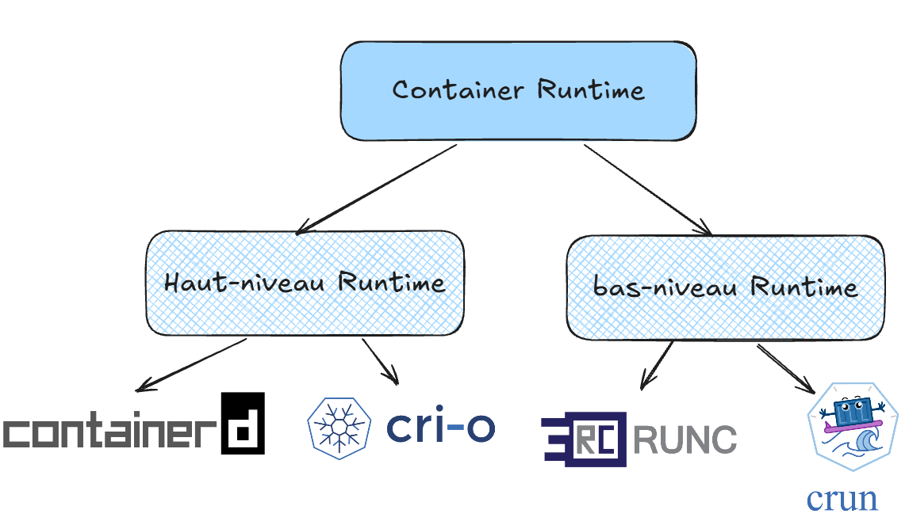
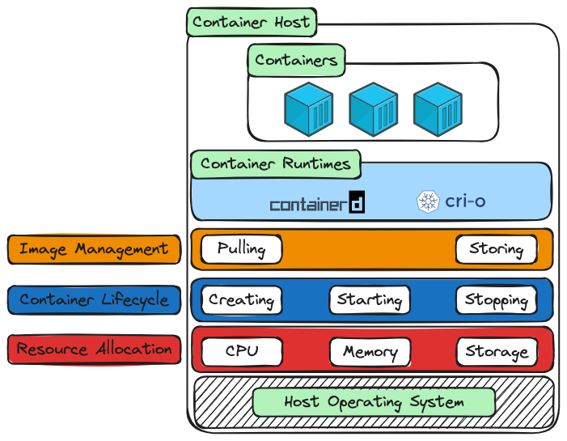
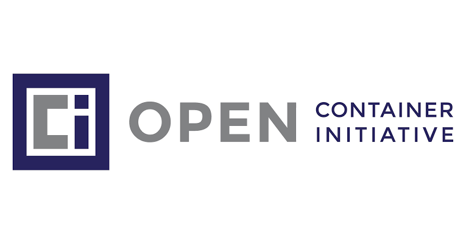

# 01 — Container Runtime, OCI, containerd et runc

> **Objectif :** comprendre le rôle d'un container runtime.

> **Idée clé :** le chapitre précédent expliquait **comment Linux isole un processus** ; ce chapitre explique **quels composants utilisent ces mécanismes pour exécuter et gérer des conteneurs**.

---

# 1. Du Linux Kernel au Container Runtime

Dans le chapitre précédent, nous avons étudié les mécanismes fondamentaux utilisés par les conteneurs :

```text
Linux Kernel
    │
    ├── Namespaces
    ├── cgroups
    ├── mounts
    ├── rootfs
    └── Process
```

Nous savons donc maintenant **comment Linux peut isoler et contrôler un processus**.

Mais une question reste :

> **Quel logiciel met en place tous ces mécanismes lorsqu'on demande de lancer un conteneur ?**

C'est le rôle du **container runtime**.


# 2. Qu'est-ce qu'un Container Runtime ?

Un **container runtime** est un logiciel responsable de la **gestion et/ou de l'exécution des conteneurs**, en utilisant les mécanismes fournis par le système d'exploitation.

Le terme est assez général. Dans l'écosystème moderne, on rencontre notamment deux niveaux :




L'idée générale est :

```text
High-Level: Gestion du conteneur
Low-Level: Exécution du processus
```

# 3. High-Level et Low-Level Runtime

## 3.1. High-Level Runtime

Un **high-level container runtime** gère les aspects généraux du conteneur, par exemple :

- les images ;
- le stockage du contenu ;
- les snapshots ;
- le cycle de vie ;
...

Exemples :

```text
containerd
CRI-O
```

> **High-level runtime = gérer et orchestrer le cycle de vie du conteneur.**

## 3.2.1 Containerd 
---

## 3.2. Low-Level Runtime

Un **low-level container runtime** est beaucoup plus proche du système d'exploitation et s'occupe de créer et exécuter le processus du conteneur.

Exemples :

```text
runc
crun
youki
```

Il utilise notamment :

```text
namespaces
cgroups
mounts
capabilities
seccomp
```

> **Low-level runtime = créer exécuter et isoler le processus du conteneur.**

# 4. Pourquoi cette séparation ?

Prenons :

```bash
docker run nginx
```

Derrière cette commande, plusieurs opérations doivent être réalisées :

```text
1. Trouver l'image
2. Télécharger l'image si nécessaire
3. Stocker ses layers
4. Préparer le filesystem
5. Créer le conteneur
6. Préparer le réseau
7. Configurer l'isolation
8. Configurer les ressources
9. Lancer le processus
```


Il est donc logique de séparer les responsabilités :

```text
High-Level Runtime
   │
   ▼
Low-Level Runtime
   │
   ▼
Linux Kernel
```

Cette séparation nous permet ensuite de comprendre pourquoi `containerd` et `runc` par exemple ne jouent pas exactement le même rôle.
# 5. Architecture Docker

Docker repose sur plusieurs composants qui collaborent pour transformer une commande comme :

```bash
docker run nginx
```

en un conteneur réellement exécuté par le **kernel Linux**.

L'architecture simplifiée est la suivante :


Chaque composant possède une responsabilité différente.

### 5.1. Docker CLI

Le **Docker CLI** est l'interface utilisée par l'utilisateur :

```bash
docker run
docker ps
docker build
docker pull
docker stop
```

Il envoie les demandes au daemon Docker.

### 5.2. dockerd

`dockerd` est le **daemon Docker**.

Il constitue le point central de gestion de Docker et reçoit les requêtes provenant du Docker CLI.

Il coordonne notamment :

- les conteneurs ;
- les images ;
- les réseaux ;
- les volumes ;
- les opérations demandées par l'utilisateur.

> **À retenir : `dockerd` est le daemon Docker, ce n'est pas le runtime OCI qui crée directement le processus du conteneur.**

### 5.3. containerd

`containerd` est un composant spécialisé dans la **gestion du cycle de vie des conteneurs**.

Il prend en charge notamment :

- la gestion des images ;
- la création et la gestion des conteneurs ;
- la gestion des tâches (processus des conteneurs) ;
- la communication avec le runtime OCI.

Il délègue ensuite l'exécution bas niveau à un runtime OCI tel que `runc`.

### 5.4. containerd-shim

Le `containerd-shim-runc-v2` sert d'intermédiaire entre `containerd` et le processus du conteneur.

Il permet notamment à `containerd` de gérer les conteneurs et leurs processus sans avoir à rester directement attaché à chaque processus exécuté.

On peut donc simplifier son rôle comme :

```text
containerd
    │
    ▼
containerd-shim
    │
    ▼
runc
```

### 5.5. runc

`runc` est un **runtime OCI de bas niveau**.

C'est lui qui utilise les mécanismes du système Linux pour créer et exécuter le processus du conteneur.

Il configure notamment :

- les namespaces ;
- les cgroups ;
- les mounts ;
- le root filesystem ;
- les capabilities ;
- les paramètres de sécurité ;
- le processus à exécuter.

C'est donc à ce niveau que les mécanismes étudiés dans le chapitre précédent sont réellement mis en place.

### 5.6. Linux Kernel

Le **kernel Linux** fournit les mécanismes fondamentaux utilisés pour isoler et contrôler les processus :

```text
Namespaces
cgroups
mounts
capabilities
seccomp
...
```

Le kernel est donc la couche qui fournit les primitives nécessaires à l'exécution des conteneurs.

> **À retenir :**
>
> **Docker CLI** → interface utilisateur  
> **dockerd** → daemon Docker  
> **containerd** → gestion du cycle de vie des conteneurs  
> **containerd-shim** → intermédiaire entre containerd et le processus  
> **runc** → exécution bas niveau selon OCI  
> **Linux Kernel** → isolation et contrôle des ressources

---

# 6. Architecture Podman

Podman utilise également des **OCI runtimes** comme `runc` ou `crun`, mais son architecture présente une différence importante par rapport à Docker :

> **Podman est daemonless : il n'utilise pas de daemon central équivalent à `dockerd`.**

Une représentation simplifiée est :


### 6.1. Podman CLI

Le **Podman CLI** est l'interface utilisée par l'utilisateur :

```bash
podman run
podman ps
podman build
podman pull
podman stop
```

Contrairement à Docker, la commande `podman` ne nécessite pas de communiquer avec un daemon central permanent.

### 6.2. Podman

Podman assure directement la gestion des opérations liées aux conteneurs.

Il peut notamment :

- créer des conteneurs ;
- gérer leur cycle de vie ;
- gérer les images ;
- gérer les pods ;
- préparer l'environnement nécessaire à l'exécution ;
- invoquer un runtime OCI.

On peut donc représenter simplement :

```text
podman
   │
   ▼
OCI Runtime
   │
   ▼
Linux Kernel
```

### 6.3. conmon

**conmon** est utilisé par Podman pour surveiller les processus des conteneurs.

Il peut notamment :

- surveiller le processus du conteneur ;
- gérer les entrées/sorties (I/O) ;
- conserver les informations nécessaires au suivi du conteneur ;
- permettre au processus du conteneur de continuer indépendamment de la commande Podman qui l'a lancé.

On peut donc retenir :

```text
Podman
   │
   ▼
conmon
   │
   ▼
runc / crun
   │
   ▼
Linux Kernel
```

### 6.4. runc ou crun

Podman peut utiliser différents **OCI runtimes**.

Par exemple :

```text
runc
crun
```

Ces runtimes ont pour rôle d'exécuter réellement le processus du conteneur en utilisant les mécanismes du kernel Linux.

### 6.5. Rootless

Une caractéristique importante de Podman est sa capacité à fonctionner en **rootless**.

Un utilisateur peut donc exécuter des conteneurs sans nécessairement disposer des privilèges `root`.

Conceptuellement :

```text
Utilisateur
     │
     ▼
  Podman
     │
     ▼
OCI Runtime
     │
     ▼
Linux Kernel
```

Cela permet notamment de réduire la dépendance à un daemon privilégié central.


> **À retenir :**
>
> Docker repose sur un **daemon central (`dockerd`)**, tandis que Podman fonctionne selon une architecture **daemonless**.
>
> Les deux peuvent utiliser un **OCI runtime** comme `runc` pour exécuter les conteneurs.

---

# 7. Différence entre Docker et Podman

Docker et Podman fournissent tous les deux des outils permettant de créer, exécuter et gérer des conteneurs.

La principale différence étudiée dans ce chapitre concerne **leur architecture et leur mode de fonctionnement**.

| Élément | Docker | Podman |
|---|---|---|
| Interface CLI | `docker` | `podman` |
| Daemon central | `dockerd` | Pas de daemon central |
| Gestion des conteneurs | `dockerd` + `containerd` | Podman |
| Runtime OCI | `runc` | `runc` ou `crun` |
| Shim | `containerd-shim` | `conmon` |
| Mode rootless | Possible | Pris en charge nativement |


> **En résumé :**
>
> **Docker** utilise une architecture basée sur un daemon central, avec `dockerd` et `containerd` qui coordonnent la gestion des conteneurs.
>
> **Podman** utilise une architecture daemonless : les commandes sont exécutées directement par Podman et les conteneurs peuvent être exécutés avec un runtime OCI comme `runc` ou `crun`.
>
> Dans les deux cas, l'exécution bas niveau repose finalement sur les mécanismes fournis par le **Linux Kernel**.

---
# 8. OCI — Open Container Initiative

Maintenant qu'on comprend la notion de runtime, une autre question apparaît :

> **Comment différents runtimes peuvent-ils fonctionner selon des règles communes ?**

C'est là qu'intervient l'**OCI**.

## 8.1. Définition

**OCI (Open Container Initiative)** définit des **standards ouverts pour les images, les runtimes et la distribution des artefacts de conteneurs**.

C'est un ensemble de **spécifications communes**.

<p align="center">
  
</p>

## 8.2. Les principales spécifications OCI

Les trois spécifications principales à connaître sont :


voir documentation officielle: https://specs.opencontainers.org/

## 8.2.1. OCI Image Specification

Elle définit le **format standard d'une image de conteneur**.

Conceptuellement :

```text
Image
 │
 ├── Manifest
 ├── Configuration
 └── Layers
```
## 8.2.3. OCI Runtime Specification

Elle définit le **modèle standard d'exécution d'un conteneur**.

Elle concerne notamment :

- le root filesystem ;
- le processus ;
- les paramètres d'exécution ;
- les namespaces ;
- les mounts ;
- les paramètres Linux ;
- le lifecycle.

Elle est notamment implémentée par des runtimes comme :

```text
runc
crun
youki
```

## 8.2.4. OCI Distribution Specification

Elle définit les règles permettant aux clients et aux registries d'échanger des artefacts OCI.

Conceptuellement :

```text
Client
  │
  │ pull / push
  ▼
Registry
```

Il faut donc distinguer :

```text
Image Specification → comment l'image est structurée

Distribution Specification → comment elle est distribuée

Runtime Specification → comment elle est exécutée
```


# Ce qu'il faut retenir

### Container Runtime

> Un **container runtime** est un logiciel chargé de gérer et/ou d'exécuter des conteneurs.

### High-Level Runtime

> Un **high-level runtime** gère les images, les conteneurs, les snapshots, les tâches et le cycle de vie.

### Low-Level Runtime

> Un **low-level runtime** crée et exécute réellement le processus du conteneur en utilisant les mécanismes du système d'exploitation.

### OCI

> **OCI définit les standards ouverts utilisés par l'écosystème des conteneurs.**

### containerd

> **containerd est un high-level container runtime qui gère le cycle de vie des conteneurs et s'appuie sur un runtime OCI pour leur exécution.**

### CRI-O

> **CRI-O est un high-level container runtime conçu pour l'intégration Kubernetes via CRI.**

### runc

> **runc est un low-level OCI runtime qui exécute les processus des conteneurs.**

### Linux Kernel

> **Le kernel Linux fournit les mécanismes fondamentaux d'isolation et de contrôle.**

# Questions de compréhension

### Question 1

Qu'est-ce qu'un **Container Runtime** ?

### Question 2

Quelle est la différence entre un **High-Level Container Runtime** et un **Low-Level Container Runtime** ?

### Question 3

Citer deux exemples de **High-Level Container Runtime**.

### Question 4

Citer deux exemples de **Low-Level Container Runtime**.

### Question 5

Quel est le rôle de l'**OCI (Open Container Initiative)** ?

### Question 6

Quelles sont les trois principales spécifications OCI ?

### Question 7

Quelle est la différence entre `containerd` et `runc` ?

### Question 8

Quelle est la différence entre `docker` et `podman` ?
