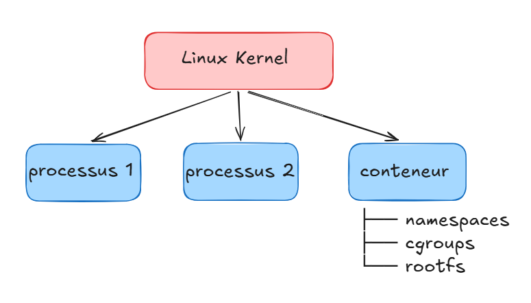

# 01 --- Construire un conteneur manuellement

> **How Linux Containers Actually Work**

Ce chapitre constitue le point de départ du **Guide complet sur la
conteneurisation**.\
L'objectif n'est pas seulement d'apprendre à lancer un conteneur, mais
de comprendre les mécanismes Linux qui permettent à un runtime comme
`runc`, `containerd`, Docker ou Podman de construire et d'exécuter un
conteneur.

> **Idée clé :** un conteneur n'est pas une machine virtuelle. C'est
> essentiellement un ou plusieurs processus Linux isolés et limités par
> le noyau Linux.

---
## Table des matières

1.  [Qu'est-ce qu'un conteneur ?](#2-quest-ce-quun-conteneur)
2.  [Conteneur vs machine virtuelle](#3-conteneur-vs-machine-virtuelle)
3.  [Ce que Docker fait sous le capot](#4-ce-que-docker-fait-sous-le-capot)
4. [Construire un mini-conteneur sans Docker](#23-construire-un-mini-conteneur-sans-docker)
5. [Relier le mini-conteneur à runc, containerd et Docker](#25-relier-le-mini-conteneur-à-runc-containerd-et-docker)
6. [Résumé](#26-résumé)
7. [Travaux pratiques](#27-travaux-pratiques)
8. [Questions de compréhension](#28-questions-de-compréhension)

---

# 2. Qu'est-ce qu'un conteneur ?

Un conteneur est un environnement d'exécution dans lequel un ou
plusieurs processus Linux disposent d'une **vue isolée du système** et
peuvent être soumis à des **limites de ressources**.

Un conteneur ne démarre pas un noyau Linux séparé.

Le processus du conteneur s'exécute directement sur le noyau de l'hôte :



La différence fondamentale avec une VM est donc l'utilisation d'un
**noyau partagé**.

### Phrase clé

> **A container is an isolated and resource-controlled Linux process
> environment, not a separate operating system.**

# 3. Conteneur vs machine virtuelle


Une *machine virtuelle* possède généralement :

``` text
Application
    │
Guest OS
    │
Virtual Hardware
    │
Hypervisor
    │
Host OS / Hardware
```

Chaque VM possède son propre système d'exploitation invité et son propre
noyau.

Un *conteneur* fonctionne plutôt ainsi :

``` text
Application
    │
Container filesystem
    │
Linux process
    │
Linux Kernel
    │
Hardware
```

Plusieurs conteneurs utilisent donc le même noyau Linux.

#### Comparaison

| Aspect | Machine virtuelle | Conteneur |
|---|---|---|
| **Isolation** | OS invité complet + hyperviseur | Namespaces + cgroups |
| **Kernel** | Séparé (chaque VM a le sien) | Partagé avec l'hôte |
| **Démarrage** | Secondes à dizaines de secondes | Centaines de ms à quelques secondes |
| **Mémoire** | Go par VM (OS inclus) | Mo (juste l'app) |
| **Sécurité** | Forte (frontière hardware) | Moindre (kernel partagé) |
| **Cas d'usage** | Isolation forte, OS différents | Microservices, CI/CD |

------------------------------------------------------------------------

# 4. Ce que Docker fait sous le capot

Quand vous lancez 
``` bash
docker run nginx
```
que se passe-t-il vraiment ? 
Docker ne crée pas une machine virtuelle, il utilise des mécanismes du noyau Linux pour isoler un processus et limiter ses ressources. Ce guide vous explique les 4 piliers de cette isolation : *namespaces*, *cgroups*, *capabilities* et *seccomp*. Comprendre ces concepts vous permettra de mieux sécuriser vos conteneurs et de diagnostiquer certains problèmes.

#### Ce que vous allez apprendre
*Namespaces* : comment Docker isole ce que le conteneur voit (processus, réseau, fichiers)
*Cgroups* : comment Docker limite ce que le conteneur utilise (CPU, mémoire, I/O)
*Capabilities* : Quelles opérations privilégiées peut-il effectuer ?
*Seccomp* : comment filtrer les appels système (system calls) autorisés

vous voyez une seule commande.

Pourtant, de nombreuses opérations sont réalisées derrière cette
abstraction.

Une représentation simplifiée est :

``` text
                     Docker CLI
                         │
                         ▼
                   Docker Engine
                         │
                         ▼
                      containerd
                         │
                         ▼
                    OCI Runtime
                    runc / crun
                         │
                         ▼
                    Linux Kernel
             ┌───────────┼───────────┐
             ▼           ▼           ▼
        Namespaces     cgroups    Filesystem
             │           │           │
             ▼           ▼           ▼
         Isolation    Resources     rootfs
```


## Lab --- Construction d'un mini-conteneur Linux

### Objectif

Construire un environnement ressemblant à un conteneur **sans utiliser
Docker**, puis observer les mécanismes Linux utilisés.

### Partie 1 --- Processus

1.  Afficher les processus de l'hôte :

``` bash
ps aux
```

2.  Afficher votre PID :

``` bash
echo $$
```

3.  Observer `/proc` :

``` bash
ls /proc/$$
```

------------------------------------------------------------------------

### Partie 2 --- Rootfs

Créer :

``` bash
mkdir -p ~/container-lab/rootfs
```

Préparer un rootfs minimal.

Tester :

``` bash
chroot ~/container-lab/rootfs /bin/bash
```

Questions :

-   Quelle est la nouvelle racine ?
-   Pourquoi `chroot` seul ne constitue-t-il pas un conteneur complet ?
-   Quels éléments sont encore partagés avec l'hôte ?

------------------------------------------------------------------------

### Partie 3 --- PID namespace

Lancer :

``` bash
unshare --pid --fork --mount-proc bash
```

Puis :

``` bash
ps aux
```

Comparer avec :

``` bash
ps aux
```

sur l'hôte.

Questions :

-   Quel processus possède le PID `1` dans le namespace ?
-   Pourquoi la liste des processus est-elle différente ?

------------------------------------------------------------------------

### Partie 4 --- UTS namespace

Créer le namespace :

``` bash
unshare --uts --fork bash
```

Puis :

``` bash
hostname
```

Modifier le hostname :

``` bash
hostname mini-container
```

Vérifier sur l'hôte que le hostname n'a pas changé.

------------------------------------------------------------------------

### Partie 5 --- Network namespace

Créer :

``` bash
unshare --net --fork bash
```

Puis :

``` bash
ip addr
ip route
```

Questions :

-   Quelles interfaces sont visibles ?
-   Pourquoi le réseau est-il différent de celui de l'hôte ?

------------------------------------------------------------------------

### Partie 6 --- Inspection des namespaces

Comparer :

``` bash
readlink /proc/1/ns/pid
readlink /proc/$$/ns/pid
```

Puis :

``` bash
readlink /proc/1/ns/net
readlink /proc/$$/ns/net
```

Répéter pour :

``` text
mnt
uts
ipc
user
```

------------------------------------------------------------------------

### Partie 7 --- Cgroups

Identifier la version :

``` bash
stat -fc %T /sys/fs/cgroup
```

Inspecter :

``` bash
cat /proc/$$/cgroup
```

Identifier les contrôleurs disponibles et expliquer comment un runtime
pourrait imposer :

``` text
CPU
Memory
PIDs
I/O
```

------------------------------------------------------------------------

### Partie 8 --- Synthèse

Compléter le schéma :

``` text
                    Mini-container
                           │
          ┌────────────────┼────────────────┐
          │                │                │
          ▼                ▼                ▼
     Filesystem        Isolation        Resources
          │                │                │
          ▼                ▼                ▼
      rootfs          namespaces        cgroups
          │                │
          │        ┌───────┼────────┐
          │        ▼       ▼        ▼
          │       PID     NET      MNT
          │
          └──────────────┬──────────────┐
                         ▼              ▼
                       process       Linux Kernel
```

------------------------------------------------------------------------

# 28. Questions de compréhension

### Q1. Un conteneur possède-t-il son propre kernel ?

**Réponse :** non. Les conteneurs partagent le noyau Linux de l'hôte.

### Q2. Quel est le rôle principal des namespaces ?

Ils fournissent une vue isolée de différentes ressources du système.

### Q3. Quel est le rôle principal des cgroups ?

Contrôler et comptabiliser les ressources consommées par les groupes de
processus.

### Q4. Quelle est la différence fondamentale ?

``` text
Namespaces → What can I see?
cgroups    → How much can I use?
```

### Q5. `chroot` suffit-il à créer un conteneur moderne ?

Non. `chroot` agit principalement sur la racine filesystem visible par
le processus. Un conteneur moderne combine plusieurs mécanismes.

### Q6. Pourquoi `root` dans un conteneur peut-il ne pas être root sur l'hôte ?

Grâce notamment aux user namespaces et aux mappings UID/GID.

### Q7. Quel est le rôle de `runc` ?

`runc` est un runtime OCI chargé d'exécuter un conteneur conformément à
une configuration OCI.

### Q8. Quel est le rôle de `containerd` ?

Il fournit notamment des fonctions de gestion du cycle de vie des
conteneurs et des images et s'appuie sur un runtime OCI pour
l'exécution.

### Q9. Pourquoi construire un conteneur sans Docker ?

Pour comprendre les mécanismes que Docker et les autres outils
abstraient.

------------------------------------------------------------------------

## À retenir avant le chapitre suivant

Le cheminement que nous venons de suivre est :

``` text
Linux Process
     │
     ├── fork / exec
     │
     ▼
Filesystem
     │
     ├── rootfs
     ├── mount
     ├── chroot
     └── pivot_root
     │
     ▼
Namespaces
     │
     ├── PID
     ├── NET
     ├── MNT
     ├── UTS
     ├── IPC
     └── USER
     │
     ▼
cgroups
     │
     ▼
Mini-container
     │
     ▼
        OCI
         │
         ▼
      runc / crun
         │
         ▼
      containerd
         │
         ▼
       Docker
```

Le chapitre suivant partira de cette base pour expliquer **comment ces
mécanismes sont standardisés par OCI et industrialisés par les runtimes
modernes comme `runc` et `containerd`**.
