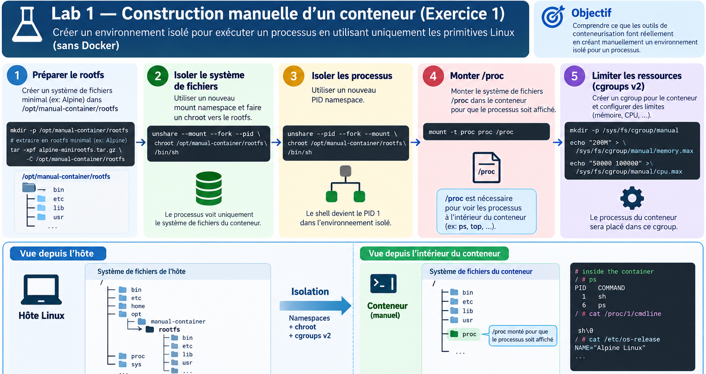

# TP1: Fondations de conteneurisation
## lab 1 Guidé: construction manuelle d'un conteneur
Selon notre cours un mini-conteneur : rootfs + namespaces + cgroups + process donne un conteneur.

on va donc Construire un environnement isolé sans Docker, Podman, containerd ou runc, en utilisant directement les primitives Linux :

0. Architecture du lab
On va construire :



1. Étape 1: Créer le rootfs

On commence par créer notre environnement :
```bash
mkdir -p /opt/manual-container/rootfs
cd /opt/manual-container
```
On va utiliser un root filesystem minimal.

Télécharger l'archive :

```bash
wget https://dl-cdn.alpinelinux.org/alpine/latest-stable/releases/x86_64/alpine-minirootfs-3.24.2-x86_64.tar.gz
```
Puis extraire l'archive:
```bash
tar -xzf alpine-minirootfs-3.24.2-x86_64.tar.gz -C /opt/manual-container/rootfs
```
Vérifier :
```bash
ls /opt/manual-container/rootfs
```
Ici, nous n'avons encore aucun conteneur.

Nous avons simplement créé :

le filesystem que le futur processus considérera comme /.

C'est exactement le rôle du rootfs décrit dans notre cours.

2. Étape 2: Tester le rootfs avec chroot

Avant de faire des namespaces, faisons une expérience simple.
```bash
chroot /opt/manual-container/rootfs /bin/sh
```
Tu es maintenant "dans" le rootfs.

Tester :
```bash
ls /
```
une erreur appelé `ls: not found`
par contre quand on donne tout le chemain ou il ya le programme executé par la command 
```bash
ls /bin/ls
```
la solution ici et d'ajouter /bin dans le path 
```bash
echo $PATH
export PATH=$PATH:/bin:/sbin:/usr/bin:/usr/sbin
```
Puis :
```bash
cat /etc/os-release
```
Tu devrais voir Alpine.

Tester :
```bash
hostname
```
Puis :
```bash
ps
```

Est-ce déjà un conteneur ?

Non.

Pourquoi ?

Parce que chroot ne fournit pas à lui seul :

isolation des processus ;
isolation réseau ;
isolation du hostname ;
isolation des mounts ;
contrôle des ressources.

Sortir :
```bash
exit
```

3. Étape 3: Créer le Mount Namespace

Maintenant nous allons réellement commencer l'isolation.

```bash
unshare --mount /bin/sh
```
Nous avons demandé au kernel Linux de créer un nouveau mount Namespace et d'exécuter /bin/sh à l'intérieur de ce namespace.

Vérifier le Mount Namespace auquel appartient mon shell actuel (celle de future conteneur):
"$$" signifie PID du shell courant.

```bash
readlink /proc/$$/ns/mnt
```
Comparer avec celle de notre os original (le Mount Namespace du processus PID 1) :
```bash
readlink /proc/1/ns/mnt
```
Tu devrais obtenir des identifiants différents :

mnt:[402653xxxx]
mnt:[402653yyyy]

Cela signifie :

Host: Mount namespace A avec id [402653xxxx]
Container: Mount namespace B avec id [402653yyyy]

4. Étape 4: Créer le PID namespace

inspecter le pid courant
```bash
echo $$
```
```bash
ps
```
Maintenant, nous allons isoler les processus.
```bash
unshare --pid --fork /bin/sh
```
Puis :
```bash
echo $$
```
Le processus shell peut maintenant apparaître comme :

PID 1

C'est exactement le concept présenté dans notre cours : un processus peut avoir une vue différente des PID du système hôte.

5. Étape 5: Créer le mini conteneur en Combinant les namespaces
on fait exit jusqu'a retourner au terminal d'os pour purger les namespaces 
```bash
exit
```
Puis:

```bash
unshare --mount --pid --uts --net --fork /bin/sh
```

6. Étape 6: Changer le hostname

Dans le namespace UTS :
```bash
hostname manual-container
```
Puis :
```bash
hostname
```
Résultat :
```bash
manual-container
```

Dans un autre terminal sur l'hôte :
```bash
hostname
```
Le hostname de l'hôte reste inchangé.

On vient donc de reproduire manuellement ce que notre cours montre avec le UTS namespace.

7. Étape 7: Entrer dans le rootfs

Maintenant *sans* faire un exit et en restant isolé:
```bash
chroot /opt/manual-container/rootfs /bin/sh
```
Puis :
```bash
/bin/ls /
```

8. Étape 8 — Monter /proc dans le conteneur

Le PID namespace a isolé l'espace des identifiants de processus (PID). /proc est un système de fichiers virtuel fourni par le noyau Linux qui expose les informations sur les processus aux outils de l'espace utilisateur tels que ps.

ps alors utilise notamment /proc pour découvrir les processus.
```bash
ps
```
ne nous donne pas nos processus de notre mini-conteneur

/proc doit être monté dans le bon Mount Namespace.

À l'intérieur du rootfs :
```bash
mount -t proc proc /proc
```

Puis refait:
```bash
ps
```
Et regarde ton résultat : PID 1
PID 1 → /bin/sh
Ton shell est donc PID 1 dans ce PID namespace

9. Étape 9: Les cgroups

Maintenant nous avons :
```bash
Namespaces
    ↓
Isolation
```
Mais nous n'avons toujours pas :

Resource limits

Une fois cgroup2 monté, le noyau expose des fichiers permettant de configurer des limites comme :
```bash
CPU
mémoire
nombre de processus
I/O, selon les contrôleurs disponibles
```
Sur un système utilisant cgroup v2 :
```bash
mount -t cgroup2 none /sys/fs/cgroup
```
Puis :
```bash
mkdir /sys/fs/cgroup/manual-container
```
Limiter la mémoire :
```bash
echo 128M > /sys/fs/cgroup/manual-container/memory.max
```
Limiter les processus :
```bash
echo 50 > /sys/fs/cgroup/manual-container/pids.max
```

Vérifier :

```bash
cat /sys/fs/cgroup/manual-container/memory.max
```
et :
```bash
cat /sys/fs/cgroup/manual-container/pids.max
```
Nous faisons ainsi manuellement le principe que Docker expose avec :

```bash
docker run \
  --memory=128m \
  --pids-limit=50 \
  ...
```
---

## lab 2 Guidé: Déployer un conteneur directement avec containerd

https://docs.docker.com/engine/install/centos/

Vous êtes administrateur d'un serveur Linux utilisé comme nœud
d'infrastructure.

Le serveur n'utilise **pas Docker**. Le moteur de conteneurs installé
est **containerd**.


Votre mission consiste à :

-   vérifier que `containerd` fonctionne ;
-   utiliser directement son outil CLI `ctr` ;
-   créer un espace de travail containerd ;
-   télécharger une image ;
-   créer un conteneur ;
-   démarrer son processus ;
-   observer les processus et les namespaces créés ;
-   identifier le rôle de `containerd-shim` et de `runc` ;
-   appliquer une limite de ressources ;

1. Vérifier l'environnement

Avant de commencer, vérifier que `containerd` est installé et fonctionne.

``` bash
sudo systemctl status containerd
```

Vérifier la version :

``` bash
containerd --version
```

Puis :

``` bash
ctr version
```

Vérifier le socket Unix utilisé par containerd :

``` bash
ls -l /run/containerd/containerd.sock
```

2. Créer un namespace containerd

containerd permet de séparer les ressources utilisées par différents
consommateurs grâce à ses **namespaces**.

Nous allons créer un namespace appelé `production`.

``` bash
sudo ctr namespaces create production
```

Vérifier :

``` bash
sudo ctr namespaces list
```

> Un namespace containerd est un mécanisme d'organisation/isolation
> logique des ressources de containerd. Ce n'est pas un namespace Linux
> et ce n'est pas une frontière de sécurité.


3. Télécharger une image directement avec containerd

Notre serveur doit exécuter un serveur Web Nginx.

Télécharger directement l'image dans containerd :

``` bash
sudo ctr -n production images pull docker.io/library/nginx:alpine
```
s'il ya un erreur Too many requests
``` bash
Pull the Python Alpine image with Docker

 docker pull python:3.12-alpine

Export the image

 docker save python:3.12-alpine -o python.tar

Import into the production containerd namespace

 sudo ctr -n production images import python.tar

Verify

 sudo ctr -n production images ls | grep pythonar
```

Vérifier les images disponibles :

``` bash
sudo ctr -n production images list
```

4. Créer un conteneur

Nous allons maintenant demander à containerd de créer un conteneur nommé
`web-server`.

``` bash
sudo ctr -n production containers create docker.io/library/nginx:alpine web-server
```

Vérifier les conteneurs :

``` bash
sudo ctr -n production containers list
```

Vous devriez retrouver :

``` text
web-server
```

Container ≠ Task

À ce stade, le conteneur est **créé**, mais son processus n'est pas
encore exécuté.

Nous avons donc :

``` text
Container
   │
   │ configuration
   ▼
Task
   │
   │ processus en exécution
   ▼
Process
```

Cette distinction est importante dans l'utilisation directe de
containerd.


5. Démarrer la task

Démarrer maintenant le processus du conteneur :

``` bash
sudo ctr -n production tasks start --detach web-server
```

Vérifier les tasks actives :

``` bash
sudo ctr -n production tasks list
```
Le processus Nginx est maintenant réellement exécuté sur le système.

6. Observer le processus du conteneur

Depuis l'hôte, rechercher le processus Nginx :

``` bash
ps aux | grep nginx
```

Vous pouvez également utiliser :

``` bash
ps -ef | grep nginx
```

Identifier le PID du processus principal.

Par exemple :

``` bash
PID=<PID>
```

Vérifier ensuite les informations du processus :

``` bash
sudo cat /proc/$PID/status
```

7. Observer les Linux Namespaces

Dans le chapitre précédent, nous avons étudié les **Linux namespaces**.

Maintenant, nous allons vérifier qu'ils sont réellement utilisés par le
conteneur créé par containerd.

Afficher les namespaces du processus :

``` bash
sudo ls -l /proc/$PID/ns/
```

Observer individuellement quelques namespaces :

``` bash
sudo readlink /proc/$PID/ns/pid
```

``` bash
sudo readlink /proc/$PID/ns/mnt
```

``` bash
sudo readlink /proc/$PID/ns/uts
```

``` bash
sudo readlink /proc/$PID/ns/ipc
```

Selon la configuration du conteneur, vous pourrez observer des
namespaces tels que :

``` text
pid
mnt
uts
ipc
net
cgroup
user
```

Le runtime OCI demande au kernel Linux de mettre en place les mécanismes
nécessaires à l'isolation.

8. Observer le containerd-shim

Maintenant que le conteneur fonctionne, rechercher les processus liés à
containerd :

``` bash
ps -ef | grep containerd
```

Rechercher spécifiquement le shim :

``` bash
ps -ef | grep containerd-shim
```

Selon la configuration utilisée, vous pourrez observer un processus
similaire à :

``` text
containerd-shim-runc-v2
```

>À retenir
>Le shim permet à containerd de maintenir la gestion du conteneur et de
>son processus sans que containerd soit directement le processus parent
>du programme exécuté dans le conteneur.

9. Observer runc

Vérifier si un processus `runc` est actuellement visible :

``` bash
ps -ef | grep runc
```

Il est possible que vous ne voyiez **pas** un processus `runc`
permanent.

C'est normal.

`runc` est généralement utilisé pour créer/configurer le conteneur puis
le processus du conteneur continue son exécution sous le contrôle de
l'environnement créé.

10. Observer les cgroups du conteneur

Afficher le cgroup du processus :

``` bash
sudo cat /proc/$PID/cgroup
```

Vérifier le système cgroup :

``` bash
mount | grep cgroup
```

Puis :

``` bash
ls /sys/fs/cgroup/
```

Selon la distribution et la configuration du système, vous pourrez
observer une hiérarchie cgroup v2.

11. Créer un conteneur avec une limite mémoire

Nous allons maintenant créer un second conteneur avec une limite de
mémoire.


``` bash
sudo ctr -n production images pull docker.io/library/python:3.12-alpine
```
dans un autre terminal "watch" le conteneur 


``` bash
sudo ctr -n production tasks ls
```
puis retourne pour ajouter un conteneur de stress 

``` bash
sudo ctr -n production run \
  --memory-limit 104857600 \
  --detach \
  docker.io/library/python:3.12-alpine \
  memory-test \
  python3 -c 'import time; a=[]; print("Starting memory stress", flush=True); [a.append(bytearray(10*1024*1024)) or print(f"Allocated {len(a)*10} MB", flush=True) or time.sleep(1) for _ in iter(int, 1)]'
``` 
Le programme Python à l'intérieur du conteneur a progressivement alloué de la RAM :

``` text
10 MB → 20 MB → 30 MB → ... → 100 MB → dépassement
```
La commande :

``` bash
--memory-limit 104857600
```

demande à containerd de configurer une limite mémoire pour le conteneur.

Vérifier ensuite l'état de conteneur dans l'autre terminal à l'aide du watch

Que se passe-t-il lorsque le conteneur atteint sa limite mémoire ?
Le conteneur continue-t-il à fonctionner ?
Quel composant du système Linux intervient lorsque la limite est dépassée ?
Quelle différence observez-vous entre le container et le task après l'arrêt ?
Pourquoi cette expérience montre-t-elle que le conteneur dépend des mécanismes du kernel Linux ?

> Pour supprimer un conteneur containerd on doit tout d'abord killer le process puis le supprimer
``` bash

sudo ctr -n production tasks kill --signal SIGKILL containername
``` 
``` bash
sudo ctr -n production tasks ls
``` 
``` bash
sudo ctr -n production containers rm containername
``` 
``` bash
sudo ctr -n production containers ls
``` 